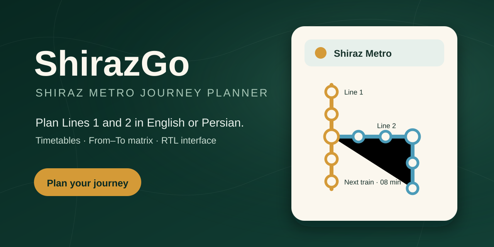

# ShirazGo

[](https://github.com/sina-04/ShirazGo/actions/workflows/ci.yml)
[](https://sina-04.github.io/ShirazGo/)
[](LICENSE)

A responsive, dependency-free Shiraz Metro journey planner for **Lines 1 and 2**, built with semantic HTML, modern CSS, and vanilla JavaScript. The interface supports persistent English and Persian modes, complete RTL layout mirroring, and Persian numerals.

**[Open the journey planner](https://sina-04.github.io/ShirazGo/)**



## Information architecture

1. **Bilingual interface** — persistent English/Persian switching, RTL support, Persian numerals, and Vazirmatn/Sahel typography.
2. **Line-aware hero** — network summary, current line status, and route preview.
3. **Journey planner** — metro line, origin, destination, date, time, and service type.
4. **Journey result** — next departure, estimated arrival, duration, route stops, and upcoming trains.
5. **From–To matrix** — travel-time and next-arrival modes for the selected line.
6. **Station directory** — service windows, operational status, planned stations, and interchange notes.
7. **Readable timetable** — a Markdown reference optimized for phones, tablets, and desktop screens.

## Timetable model

### Line 1

- Full service across 20 stations.
- Working-day terminal departures:
  - Shahid Dastgheyb → Ehsan: 06:10–22:10
  - Ehsan → Shahid Dastgheyb: 06:05–22:05
- Weekend/holiday terminal departures:
  - Shahid Dastgheyb → Ehsan: 07:10–21:10
  - Ehsan → Shahid Dastgheyb: 07:05–21:05
- Scheduled interval: 15 minutes.
- Station offsets were reconstructed from the supplied 20-page timetable.

### Line 2

- Published operating section: Ghahremanan ↔ Imam Hossein, 5 stations.
- Operating station order: Ghahremanan → Shohada-ye Adelabad → Basij → Esteghlal → Imam Hossein.
- Working-day first departures:
  - Ghahremanan → Imam Hossein: 06:00
  - Imam Hossein → Ghahremanan: 06:20
- Scheduled interval: 40 minutes.
- Final terminal departures: 18:00 from Ghahremanan and 17:40 from Imam Hossein.
- Published end-to-end travel time: 16 minutes.
- Basij ↔ Esteghlal is supported in both directions as a 3-minute journey.
- No regular weekend/official-holiday service is published in the supplied timetable.

## Data limitations

Line 1 is reconstructed from its supplied station timetable. Line 2 is reconstructed from the supplied 18-page working-day timetable, including its station-specific offsets and 40-minute departure sequence. Operational changes can still supersede these files, so station notices take precedence.

ShirazGo is an independent planning aid, not an official transit publication.
Schedules can change without notice; confirm critical journeys using current
station announcements or official operator channels.

## Run locally

Open `index.html` directly, or serve the folder:

```bash
python -m http.server 8080
```

Then visit `http://localhost:8080`.

## Files

- `index.html` — semantic page structure
- `styles.css` — responsive design system, Persian font stack, and RTL component rules
- `app.js` — multi-line timetable engine, bilingual content, localization, and interaction logic
- `assets/shiraz-subway-timetable.md` — accessible timetable reference for Lines 1 and 2

## License and data terms

Original site code and documentation are available under the
[MIT License](LICENSE). Official timetable PDFs, transit data, operator names
and marks, and third-party fonts are not relicensed. See
[`THIRD_PARTY_NOTICES.md`](THIRD_PARTY_NOTICES.md).
